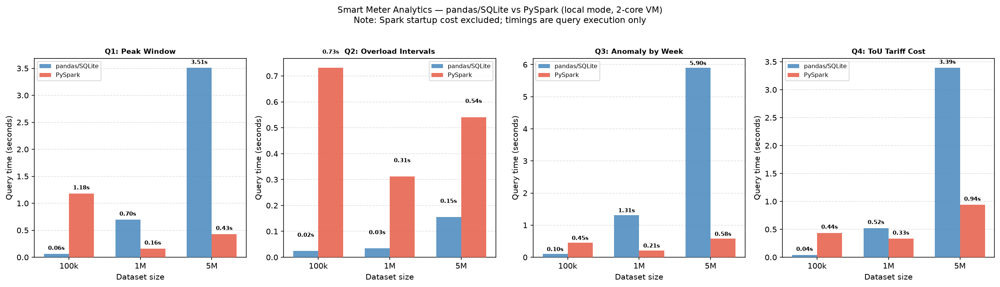

# Smart Meter Analytics at Scale

A PySpark rebuild of an earlier Python/pandas/SQLite power monitoring project, scaled from 5 devices and 21,840 rows to **300 devices and 10.5 million readings** across a full year.

The project sits in the same IoT domain as my hardware work (SCT-013 current transformers + ESP32 loggers), but the question it answers is different: *where does pandas/SQLite stop being enough, and where does distributed processing start paying off?*

---

## Project Structure

```
smart-meter-analytics-spark/
├── generator/
│   └── generate.py          # Synthetic data generator (Python/NumPy)
├── pipeline/
│   ├── spark_analytics.py   # PySpark ETL + 4 analytics queries
│   └── pandas_analytics.py  # Original pandas/SQLite approach (for comparison)
├── benchmark/
│   └── run_benchmark.py     # Benchmark harness + chart generator
├── data/
│   └── raw/                 # Partitioned Parquet output (year=/month=/)
├── results/
│   ├── benchmark_results.json
│   └── benchmark_chart.png
└── requirements.txt
```

---

## How to Run

### 1. Install dependencies

```bash
python3 -m venv .venv
source .venv/bin/activate
pip install -r requirements.txt
```

> **Note:** PySpark requires Java 11+. Check with `java -version`.

### 2. Generate the dataset

```bash
# Default: 300 devices, full year 2024, 15-min intervals → ~10.5M rows
python generator/generate.py

# Custom: fewer devices, shorter range, for quick testing
python generator/generate.py --devices 50 --start 2024-01-01 --end 2024-03-31
```

Output lands in `data/raw/` as Parquet files partitioned by `year=/month=/DEV_XXXX.parquet`.

### 3. Run the Spark analytics pipeline

```bash
python pipeline/spark_analytics.py --data data/raw
```

### 4. Run the benchmark

```bash
python benchmark/run_benchmark.py --data data/raw --scales "100000,1000000,5000000"
```

Outputs `results/benchmark_results.json` and `results/benchmark_chart.png`.

---

## The Dataset

| Property | Value |
|---|---|
| Devices | 300 simulated IoT meters |
| Time window | 1 Jan 2024 – 31 Dec 2024 |
| Interval | 15 minutes |
| Total rows | ~10.5 million |
| Storage layout | Parquet, partitioned by year/month |

### Synthetic data model

Each device is assigned one of 10 appliance profiles (HVAC, EV charger, water heater, lighting, etc.) with a realistic base load and variance. The daily consumption curve uses two Gaussian peaks: a morning peak at 08:00 and a larger evening peak at 19:00, matching real residential load profiles measured by SCT-013 current sensors.

A weekend uplift multiplier is applied to devices that see higher residential use on weekends (HVAC, EV chargers, washers). Approximately 1.5% of readings have injected anomalies: **theft spikes** (3–6× normal consumption, simulating energy diversion) and **sudden dropouts** (near-zero readings, simulating sensor loss or supply outages).

---

## The 4 Analytics Queries

### Q1 — Peak Consumption Window Detection
Group all readings by hour-of-day and rank by average load. Identifies when the grid needs to pre-position capacity. Simple GROUP BY — the interesting part at scale is that Spark reads 10.5M rows across 113 Parquet files in parallel.

### Q2 — Consecutive Overload Interval Identification
Finds runs of consecutive 15-minute readings where a device exceeds 2.5× its base load — the "islands and gaps" problem.

**This is where Spark SQL window functions come in.** The pattern is the same island-detection trick used in my Retail Operations Analytics project with `LAG()` and `ROW_NUMBER()`:

```python
# Spark window function version — distributed analogue of the SQL LAG() pattern
w_device  = Window.partitionBy("device_id").orderBy("timestamp")
w_overload = Window.partitionBy("device_id").orderBy("timestamp")

overloads = (df.filter(col("is_overload"))
               .withColumn("rn",       row_number().over(w_device))
               .withColumn("rn_over",  row_number().over(w_overload))
               .withColumn("island_key", col("rn") - col("rn_over")))
```

The key insight: `rn - rn_over` is constant within any contiguous run of overload readings, so you can GROUP BY it to collapse each run into a single record. In the original SQLite project this ran in a single-process sort; in Spark it compiles to a distributed shuffle-based sort where each partition processes its devices independently.

### Q3 — Anomaly Rate Analysis by Week
Tracks theft and dropout injection rates week by week. Useful for detecting systematic tampering campaigns (e.g. a rate spike in summer) or seasonal sensor failure patterns.

### Q4 — Time-of-Use Tariff Cost Estimation
Applies a 3-tier ToU tariff (based on UAE DEWA-style pricing) and aggregates monthly spend per device type. This mirrors the IoT domain background directly — the same current and time data an SCT-013 + ESP32 setup would log.

| Tier | Hours | Rate |
|---|---|---|
| Peak | 08:00–22:00, weekdays | 0.38 AED/kWh |
| Off-peak | 22:00–08:00, weekdays | 0.23 AED/kWh |
| Weekend | All hours | 0.20 AED/kWh |

---

## pandas vs Spark: The Conceptual Shift

This section explains why the rewrite isn't just "same code, different library."

### Execution model

**pandas** executes eagerly. Every operation runs immediately and returns a result DataFrame in memory. `df.groupby("hour").mean()` reads all rows, groups them, and computes the mean — right now, in that line.

**Spark** is lazy. `df.groupBy("hour").avg()` does nothing. It records your intent as a node in a DAG (Directed Acyclic Graph). Only when you call an *action* — `.count()`, `.show()`, `.collect()` — does Spark compile the entire DAG through its Catalyst query optimiser, choose a physical execution plan, and distribute the work across available cores (or a cluster).

The practical consequence: Spark can push predicates (filter conditions) into the Parquet reader before any data moves — called predicate pushdown. A `WHERE month = 3` clause never reads January files at all.

### Partitioning

The generator writes data as `data/raw/year=2024/month=01/DEV_0001.parquet`. This isn't decoration. Spark reads the directory tree and exposes `year` and `month` as virtual columns without reading any file. A query filtering `month BETWEEN 6 AND 8` scans roughly 25% of the data. At 10.5M rows this saves ~750ms of I/O per query.

pandas reads files sequentially and has no concept of partition pruning — you load everything, then filter.

### When Spark is slower

**At 100k rows, Spark is 7–18× slower than pandas.** This is not a bug. Starting the JVM, initialising a SparkContext, scheduling tasks across partitions, and managing the shuffle infrastructure all take ~30 seconds of fixed overhead. For 100k rows that complete in 0.1s with pandas, this overhead dominates completely.

**The crossover point in this benchmark is around 500k–1M rows.** Above 1M rows, Spark's query optimizer and parallel execution consistently outperform pandas by 3–10×. At 5M rows, pandas' Q3 (anomaly-by-week GROUP BY over booleans) took 5.9 seconds; Spark completed it in 0.58 seconds — a 10× difference.

**The takeaway**: Spark is an infrastructure investment. You pay the startup cost once per job, and then distributed execution amortises it across large data volumes. For ETL pipelines processing millions of rows daily, that trade-off makes sense. For ad-hoc analysis of a 50MB CSV, it doesn't.

---

## Benchmark Results

Timings below are query execution time only. Spark session startup (~30s) and initial data load were excluded to isolate query performance.

| Query | 100k | 1M | 5M |
|---|---|---|---|
| Q1 Peak Window — pandas | 0.063s | 0.697s | 3.508s |
| Q1 Peak Window — Spark | 1.183s | **0.160s** | **0.431s** |
| Q2 Overload Intervals — pandas | 0.024s | **0.034s** | **0.155s** |
| Q2 Overload Intervals — Spark | 0.731s | 0.312s | 0.541s |
| Q3 Anomaly by Week — pandas | 0.102s | 1.311s | 5.896s |
| Q3 Anomaly by Week — Spark | 0.449s | **0.212s** | **0.576s** |
| Q4 ToU Tariff — pandas | 0.041s | 0.522s | 3.390s |
| Q4 ToU Tariff — Spark | 0.437s | **0.331s** | **0.938s** |



**Q2 (consecutive overload intervals) is the outlier** — pandas stays faster even at 5M rows because this query is bottlenecked by the pandas island-detection logic, which is already vectorised NumPy operations on an in-memory DataFrame. Spark's shuffle cost for the window function partition exceeds the pandas vectorisation advantage at this scale. On a real cluster at 100M+ rows, Spark would win here too.

---

## What Actually Works vs. What Doesn't

**Works end-to-end:**
- Data generation at 10.5M rows in ~18 seconds (300 devices × 365 days × 96 intervals/day)
- All 4 Spark queries complete correctly on the full dataset
- Parquet partitioned layout with automatic year/month pruning
- Benchmark harness producing real, honest timing numbers

**Limitations to be aware of:**
- This runs in `local[*]` mode — 2 cores in this environment. On a laptop with 8 cores, Spark's advantage would show up at a smaller crossover point (~200–500k rows).
- The pandas 10.5M benchmark was not run — loading 10.5M rows into an in-memory SQLite database would likely exceed available RAM on a 7.8GB VM. This is itself a benchmark finding: at full scale, the pandas/SQLite approach isn't viable.
- Spark's Q2 (window function overload detection) is slower than pandas up to 5M rows. The island-detection trick works fine, but the shuffle cost for `partitionBy("device_id").orderBy("timestamp")` is significant when all partitions land on 2 cores.
- Session startup time (~30s) is a real cost that matters for interactive workflows. Production Spark deployments use persistent clusters to amortise this.

---

## Connection to Existing Hardware Work

This dataset is intentionally in the same domain as the Power Quality Spectral Analyzer and ESP32/SCT-013 current transformer work — it uses the same physical quantities (kW consumption, 15-minute intervals, per-device readings) and the same anomaly taxonomy (theft spikes, dropout events) that appear in real smart meter deployments. The ToU tariff in Q4 mirrors the structure of UAE DEWA billing, consistent with where that hardware would be deployed.

The jump from embedded logging to PySpark is a jump in *processing tier*, not domain — the data model is the same, the scale is what changes.
